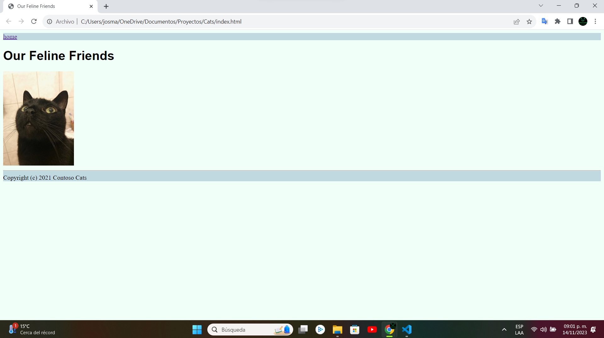

# Presentación

El propósito de este repositorio va más allá de simplemente contener una página web. Se ha creado con el objetivo específico de explorar y comprender el funcionamiento de las ramas en GitHub. Esta iniciativa permite a cada usuario trabajar en distintas ramas dentro del mismo repositorio, facilitando el proceso de colaboración. La intención es experimentar con la creación de ramas, realizar cambios independientes, y finalmente, entender el proceso de fusionar estos cambios mediante pull requests. Este enfoque práctico busca brindar una experiencia efectiva en el uso colaborativo de GitHub.

<h1 align="center"> Página web de nuestros amigos felinos </h1>

 Pantalla principal de la página web 

# Tabla de contenidos:

---

- [Badges](#badges)
- [Capturas de pantalla](#capturas-de-pantalla)
- [Descripción del proyecto](#descripción-del-proyecto)
- [Herramientas utilizadas](#herramientas-utilizadas)
- [Guía de instalación](#guía-de-instalación)
- [Autor](#autores)
- [Información adicional](#información-adicional)

# Badges

---

- Estado del Proyecto: 
- Versión Actual: 
- Uso de dependencias: 
- Tipo de proyecto: 
- Categoría del proyecto: 

# Capturas de pantalla

---

Las capturas de pantalla a continuación ofrecen una visión detallada del proceso de trabajo con diversas ramas en este repositorio.

## Capturas de pantalla de pantalla principal

# Descripción del proyecto

---

# Herramientas utilizadas

---

- [Git](https://git-scm.com/)
- [GitHub](https://github.com/)
- [Visual Studio Code](https://code.visualstudio.com/)
- [HTML](https://developer.mozilla.org/es/docs/Web/HTML)
- [CSS](https://developer.mozilla.org/es/docs/Web/CSS)
- [ColorCode](https://htmlcolorcodes.com/es/)
- [Shields.io](https://shields.io/badges/static-badge)

# Guía de instalación

---

¡Bienvenido al repositorio de Cats! Aquí tienes una guía detallada sobre cómo descargar y utilizar el proyecto que alberga este repositorio. ¡Empecemos!

1. **Descargar el Repositorio:**

   - Ve al repositorio en GitHub: https://github.com/Josmar360/Tintoreria_Aries_BD
   - Haz clic en el botón verde "Code" y selecciona "Download ZIP".
   - Descomprime el archivo ZIP en la ubicación de tu elección.

# Autor/es

---

[Josmar Gustavo Palomino Castelan](https://linktr.ee/josmar360)

# Información adicional

---

El propósito fundamental de este repositorio trasciende la mera contención de una página web. Se ha concebido con el propósito específico de explorar y comprender a fondo el funcionamiento de las ramas en GitHub. Esta iniciativa proporciona a cada usuario la capacidad de trabajar en diversas ramas dentro del mismo repositorio, simplificando así el proceso de colaboración. La meta es sumergirse en la creación de ramas, implementar cambios de forma independiente y, finalmente, comprender el proceso de fusionar estos cambios mediante pull requests. Este enfoque práctico busca proporcionar una experiencia integral y efectiva en el uso colaborativo de GitHub.

- [Regresar al inicio](#presentación)
